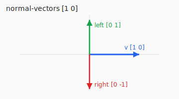

# v2

2D vector math on `[x y]` pairs.

Vectors are plain Clojure vectors of two numbers. Operations return new
vectors (or numbers); nothing is mutated.

Examples assume `(require '[com.github.damn.v2 :as v2])`.

```clojure
(require '[com.github.damn.v2 :as v2])
```

> This file is generated from API docstrings. Run `lein gen-readme` after editing them.

## Install

```clojure
;; project.clj
:repositories [["jitpack" "https://jitpack.io"]]
:dependencies [[com.github.damn/v2 "COMMIT_OR_TAG"]]
```

Lookup: https://jitpack.io/#damn/v2

## API

Examples in each docstring are locked by the unit tests.

### `add`

**Arglists:** `[v1 v2]`

Component-wise sum of two vectors.

```clojure
(v2/add [1 2] [3 4])
;; => [4 6]
```


### `move`

**Arglists:** `[position {:keys [direction speed delta-time]}]`

Translate `position` along a unit (or any) `direction` by `speed * delta-time`.

```clojure
(v2/move [0 0] {:direction [1 0] :speed 10 :delta-time 0.5})
;; => [5.0 0.0]
```

### `scale`

**Arglists:** `[[x y] scalar]`

Multiply both components by `scalar`.

```clojure
(v2/scale [2 4] 0.5)
;; => [1.0 2.0]
```

### `dot`

**Arglists:** `[[this-x this-y] [x y]]`

Dot (scalar) product. `0` when perpendicular, positive when same-ish direction.

```clojure
(v2/dot [1 0] [0 1])  ;; => 0
(v2/dot [1 0] [1 0])  ;; => 1
(v2/dot [2 3] [4 5])  ;; => 23
```

### `crs`

**Arglists:** `[[this-x this-y] [x y]]`

2D cross product (z-component of 3D cross). Positive when `v2` is
counter-clockwise from `v1`.

```clojure
(v2/crs [1 0] [0 1])  ;; => 1
(v2/crs [1 0] [1 0])  ;; => 0
```

### `length`

**Arglists:** `[[x y]]`

Euclidean length (magnitude).

```clojure
(v2/length [3 4])  ;; => 5.0
(v2/length [0 0])  ;; => 0.0
```

### `normalise`

**Arglists:** `[[x y :as v]]`

Unit vector in the same direction. Zero vector stays `[0 0]`.

```clojure
(v2/normalise [3 4])  ;; => [0.6 0.8]
(v2/normalise [0 0])  ;; => [0 0]
```

### `normal-vectors`

**Arglists:** `[[x y]]`

Two vectors perpendicular to `v` (left-hand and right-hand normals).
Not normalised; same length as `v`.

```clojure
(v2/normal-vectors [1 0])
;; => [[0.0 1] [0 -1.0]]
```



### `direction`

**Arglists:** `[[sx sy] [tx ty]]`

Unit vector from point `from` toward point `to`. Equal points → `[0.0 0.0]`.

```clojure
(v2/direction [0 0] [3 4])  ;; => [0.6 0.8]
(v2/direction [1 1] [1 1])  ;; => [0.0 0.0]
```

### `distance`

**Arglists:** `[[x1 y1] [x2 y2]]`

Euclidean distance between two points.

```clojure
(v2/distance [0 0] [3 4])  ;; => 5.0
```

### `angle-deg`

**Arglists:** `[this reference]`

Angle in degrees from `reference` to `this`, counter-clockwise, in `[0, 360)`.

```clojure
(v2/angle-deg [1 0] [0 1])  ;; => 270.0
(v2/angle-deg [0 1] [0 1])  ;; => 0.0
```

### `angle-from-vector`

**Arglists:** `[v]`

Heading of `v` in degrees where up `[0 1]` is `0`, counter-clockwise
(left `[-1 0]` is `90`, down `[0 -1]` is `180`, right `[1 0]` is `270`).

```clojure
(v2/angle-from-vector [0 1])   ;; => 0.0
(v2/angle-from-vector [-1 0])  ;; => 90.0
(v2/angle-from-vector [0 -1])  ;; => 180.0
(v2/angle-from-vector [1 0])   ;; => 270.0
```


### `double-ray-endpositions`

**Arglists:** `[[start-x start-y] [target-x target-y] path-w]`

Two parallel segment endpoints offset left/right of the line from `start`
to `target` by half of `(path-w + 0.02)`.

Returns `[start1 target1 start2 target2]`. `path-w` must be `< 0.98`.

```clojure
(v2/double-ray-endpositions [0 0] [10 0] 0.5)
;; => [[0.0 0.26] [10.0 0.26] [0.0 -0.26] [10.0 -0.26]]
```


## License

MIT
